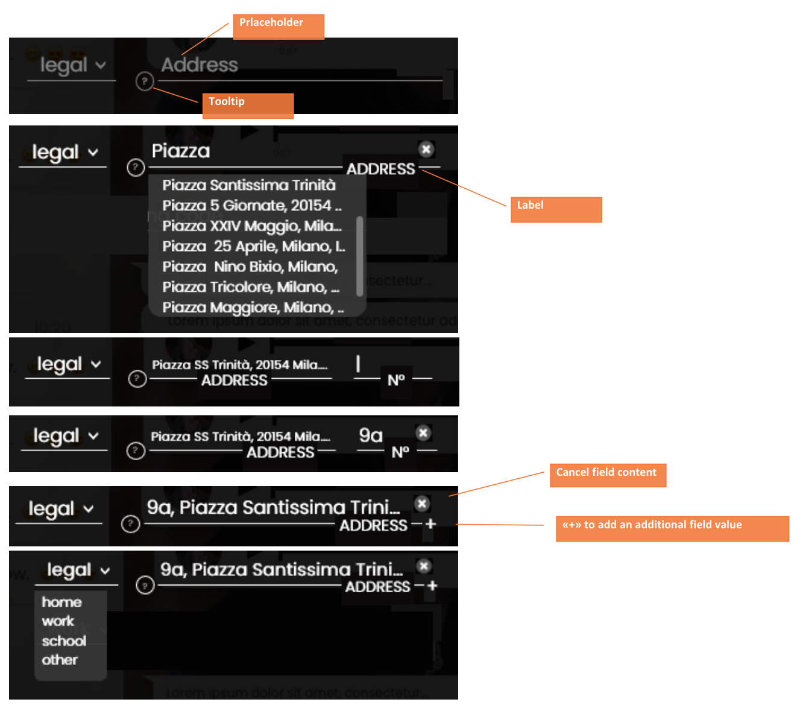

# Address input field

This field allow to enter a street address. 

It's composed of 2 parts: the address type(that can be elected via a dropdown or not, according to the situation) + the Address (an editable string with google maps suggestions, that include the street number). 

## The address type can be:
* Residential
* Domicile
* Legal
* Operational

It can be possible to add one or more addresses. 

**The address** is selected using Google Maps API, in order to get all the information related to:street, house number, zip code, town, major town, country and alsothe GPS (geographical) coordinates, useful to map addresses on a map. 

The selection process is as follow:

1. User can change address type (default=residential). In the dropdown must be shown only the above options
2. User start typing the address and select one of the Google suggestions
3. After selecting one of the Google suggestion, it should be possible to enter or confirm the address number in a separate field that temporary appear in the address area; when the user move to away from the number field the address number is than added directly inthe address string (at the beginning). Please note that the number can be a string (examples of address number “4a”, “4/1”, “km 124”, ..).

## OTHER COMMON FIELD FEATURE:

* **Placeholder**: string to be shown (in gray color), when the field is empty (i.e. “Sport interest”)
* **label**: string to be shown (in white and always in capital letters), when the field is filled (i.e. “SPORT INTEREST”). The header string can bedifferent from the placeholder one.* **Tooltip**: hint string, optional (can be activated or not). To display useful info on the field. If present, is displayed via a circled “?”; the tooltipcontent is shown on mouse over (landscape) or click (portrait).
* **Cancel field content**: it allows to cancel the actual field content. It appears only when the field accept only one content and:
  * the cursor is in the field and at least a char has been typed
  * the field has an existing content.
  * The content are not included in cookies
* **Add New Entry “+”**: it allow to enter multiple values. The “+” icon, displayed at the right end side of the field line, appears once at least avalue has been inputed; when clicked, it adds an additional field to add an additional value.PrlaceholderTooltipCancelfield content«+» to add an additional field valueLabel
